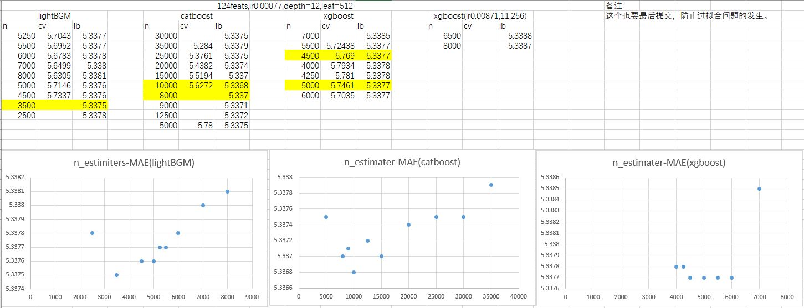
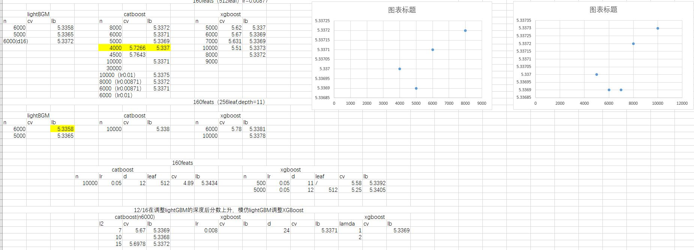
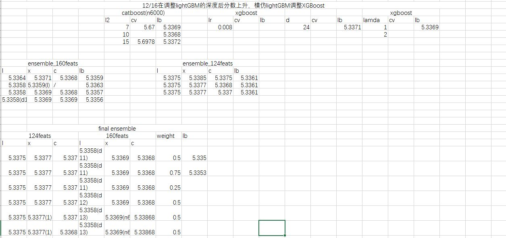
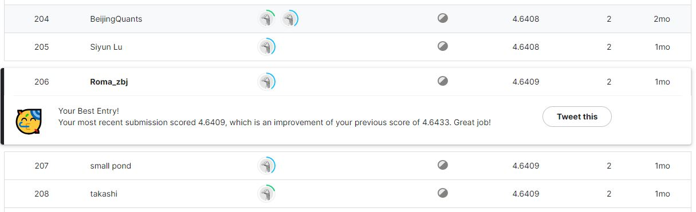
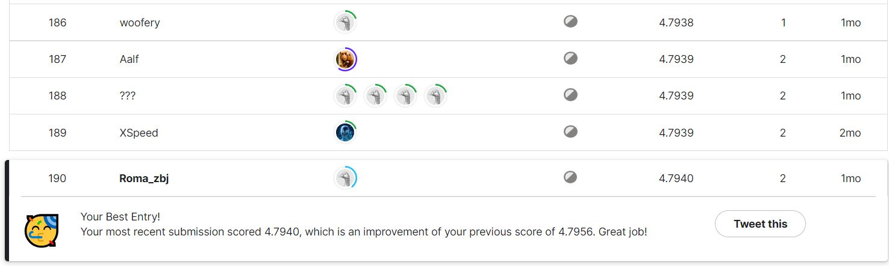

# Kaggle feature competition:Optiver[LB 6%] 
[Kaggle Optiver introduce](https://www.kaggle.com/competitions/optiver-trading-at-the-close) 
[LeaderBoard](https://www.kaggle.com/competitions/optiver-trading-at-the-close/leaderboard) 
**1.Method** 

**Experiment** 
 
 
 
**Update 1** 
 
**Update 2** 

